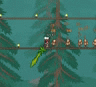

# MeleeRevamp
Melee Revamp is a mod in development that aims at reworking attack ways of vanilla melee weapons. This mod reworks the attacking ways of melee weapons so they have better attacking moves and vfx. 
Most broadswords now follows a default attack pattern. Several weapons like the blade or grass have special attacking moves and alternative attacks. Right click to trigger alternative attacks. The latter can be disabled in config.
This mod adds a sword power gauge system to each reworked melee weapon, which is a resource that can boost damage and alternative attack effects if weapons are used properly. This can be disabled in config.
This mod is under development. This mod plans to rework most melee weapons (mostly swords, but also include weapons like spears, flails and others) and add more moves so different weapons have entirely different attack patterns.
Due to compatibility issue, True Night's Edge and Terra Blade will be reworked in future versions.

TODO:
1. Rework the 4 materials of Nights Edge (Blade of Grass done) and some other starter melee swords
2. Improve default broadsword revamp compatibility
3. Look into the revamp of starter spears to make them throwable
