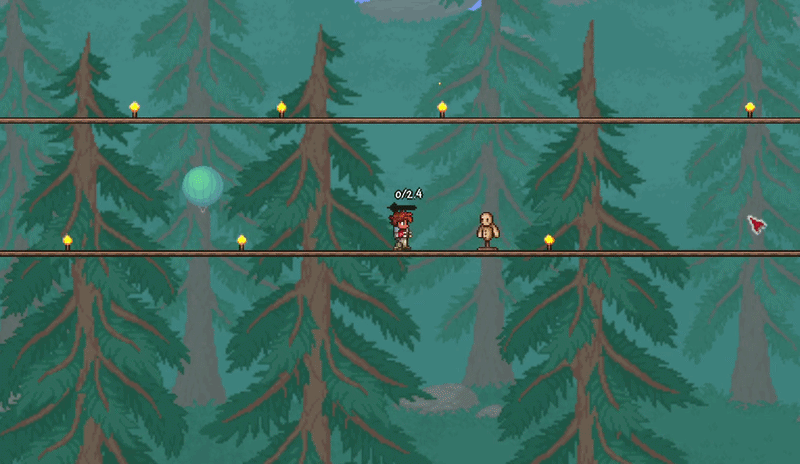
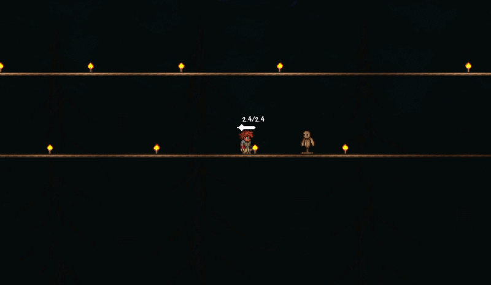
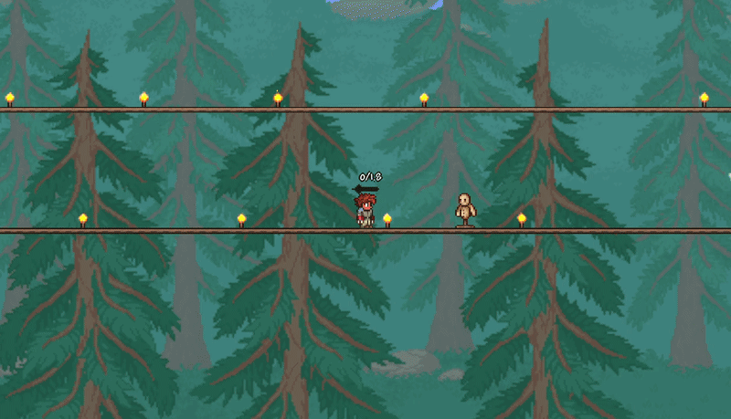

# MeleeRevamp: Revamped Melee Combat & VFX Framework for Terraria

MeleeRevamp is a technical overhaul for Terraria melee weapon combat. It focuses on expanding the vanilla engine's limitations through custom graphics hooks and a new melee system design.
By leveraging custom graphics pipelines and decoupled logic-rendering systems, MeleeRevamp introduces dynamic move sets, new VFX, and a resource-driven "Sword Power" gauge. This mod aims at transforming traditional broadsword combat experience from projectile shooting into a sophisticated combat system.
Most broadswords now follows a default attack pattern. Several weapons like the blade or grass have special attacking moves and alternative attacks. Right click to trigger alternative attacks. The latter can be disabled in config.
This mod adds a sword power gauge system to each reworked melee weapon, which is a resource that can boost damage and alternative attack effects if weapons are used properly. This can be disabled in config.
This mod is under development. This mod plans to rework most melee weapons (mostly swords, but also include weapons like spears, flails and others) and add more moves so different weapons have entirely different attack patterns.
Due to compatibility issue, True Night's Edge and Terra Blade will be reworked in future versions.

## Project Technical Structure / 项目技术架构

### 1. Multi-pass Render Pipeline | 多层级渲染管线
* Developed a custom post-processing framework by hooking the XNA/FNA render graphics device. Implemented a linear rendering workflow from scene capture to off-screen butter to post-processing injection and final composition. 
* 通过 Hook 拦截原引擎渲染端点，基于 RenderTarget2D 的完整的后处理管线。实现了从场景采集、离屏特效注入到最终合成的线性渲染流程。

### 2. GPU-Driven VFX System | GPU 驱动视觉特效系统
* Authored 10+ core HLSL shaders (Dissolve, Dynamic Noise Distortion, Fluid Simulation). Optimized DrawCalls by batching similar effects through render state management, ensuring stable 60FPS during high-density combat.
* 编写并封装了 10+ 个核心 HLSL Shader（程序化溶解、动态噪声、流体等）。通过渲染状态管理将同类特效 DrawCall 合并，确保在大规模弹幕环境下帧率稳定。

### 3. Modular State Machine (FSM) | 模块化状态机
* Built a decoupled architecture where C# logic drives Shader parameters (e.g., distortion intensity linked to swing velocity), separating visual feedback from combat mechanics.
* 开发了一套 FSM 逻辑，实现了业务逻辑与视觉表现的解耦（如 C# 驱动 Shader 参数实现随挥砍速度动态变化的扭曲效果）。

---

## Gallery

*Default swords: Procedural slashes with custom distortion shaders.*

*Night's Edge: Procedural stabs with distortion & camera control.*

*Volcano: Procedural flame with bloom.*

---

## Development & Architecture
* **Language:** C#
* **Graphics API:** HLSL (SM 3.0+), XNA/FNA Framework
* **Core Contribution:** 6,000+ lines in this standalone melee & VFX library.

---

## Credits & References / 致谢与参考
* Special thanks to the following developers and resources that inspired this project:
* Rendering Pipeline: The core RenderTarget2D architecture was inspired by the implementation from [yiyang233 (Bilibili)](https://space.bilibili.com/24132024).
* 底层 RenderTarget2D 离屏渲染链路参考了 Bilibili 开发者 [yiyang233](https://space.bilibili.com/24132024) 的技术实现。
* Bloom Effect: The post-processing Bloom algorithm is based on the work by [robobo1221 on ShaderToy](https://www.shadertoy.com/view/lsBfRc).
* 后处理辉光（Bloom）算法基于 ShaderToy 开发者 [robobo1221](https://www.shadertoy.com/view/lsBfRc) 的高斯模糊/采样逻辑进行适配。
* Engine Support: Developed using the TModLoader / FNA Framework.